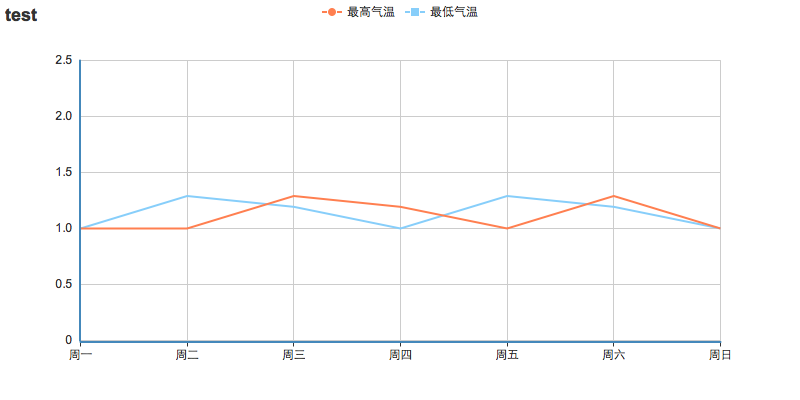

# echarts-server-image

echarts配合phantomjs，在服务端生成图片。

# Usage

```bash
npm install phantomjs -g
https://github.com/hushicai/echarts-server-image.git
cd echarts-server-image
npm install
node phantom/echarts.js
```

# 示例


